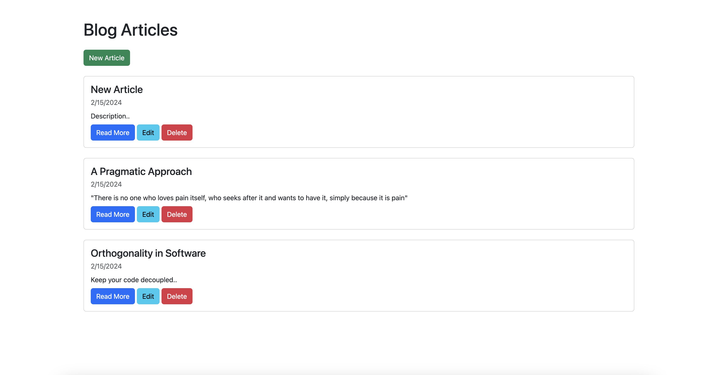

## A Markdown Blog
### Node.js, Express, MongoDB
- User can add, delete and edit blog
- Enables writing blogs in Markdown for easy formatting and readability
- Used dompurify to avoid any malicious character in markdown

- To start the server

```
npm run devStart
```
### This is the preview of the application: 


- You can watch the application video with the path(mov/preview.mp4)